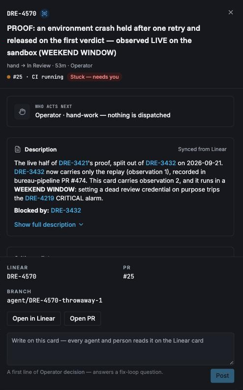
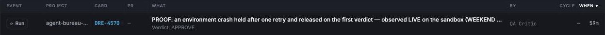

# An environment crash held after one retry, with its cause named — the proof record

The proof for [DRE-3432](https://linear.app/dreadnoughtfoundry/issue/DRE-3432),
from epic [DRE-3421](https://linear.app/dreadnoughtfoundry/issue/DRE-3421).
Every time below is Pacific (PDT, UTC−7).

**Where this stands.** This record is DRE-3432's, and **DRE-3432 is observation
1 only** — the offline replay of pull request #2370, made on 2026-09-20 between
12:38 and 12:55 PT and recorded in full below. That is the whole of what this
card claims, and §1 plus the checklist at the end is the whole of its proof.

**Observation 2, the live dead-credential run on the sandbox repository, is
owned by
[DRE-4570](https://linear.app/dreadnoughtfoundry/issue/DRE-4570), not by this
card.** DRE-3421 was split on 2026-09-21 at 20:25 PT: DRE-3432 keeps the replay,
DRE-4570 takes the live run and is blocked by DRE-3432. *The rest of this
paragraph is the plan as written before the run, left unchanged:* DRE-4570 is
scheduled for a weekend window, because setting the review credential to a dead
value on purpose trips the DRE-4219 CRITICAL credential alarm, and that alarm
must not fire during a working day. §2 is a forward pointer to that work —
nothing in it is claimed here, and nothing in it blocks this card. DRE-4570
appends its observations to this same file when it runs.

**Update, 2026-09-29: observation 2 has run.** It was made live on 2026-09-29,
18:43–20:46 PT, and is recorded in §3. Criteria 1 and 2 and the credential
restore were observed. The console criterion was not met. It ran on a Tuesday
evening, not in the planned weekend window, and no approval of that change is
recorded, so §3 records it as a deviation from the card (see "What else
happened").

**The replay script is committed beside this record** at
[`docs/evidence/DRE-3432/replay_2370.py`](evidence/DRE-3432/replay_2370.py).
**The captured fixture it reads is not committed.** This repository is public,
and the fixture is 31 files of raw material from the private
`dreadnought-foundry/agent-bureau` repository and the private Linear workspace:
three full CI job logs, the whole comment thread of #2370, agent-bureau's run
records for the window, and card DRE-3388's comments. It carries no credential
(every secret in the logs is masked `***` by GitHub), but it is private-repo
content. It stays on the operator's machine, and the table in §1 lists every
file in it and the command each was captured with, so an operator token can
capture it again.

**Why the script is committed at all, and what it is.** DRE-3432's own `Files:`
line names exactly two paths — this record and
`docs/evidence/DRE-3432/replay_2370.py` — so the script is inside the card, not
an extra. It is committed because without it this record is an assertion rather
than a method.

**Everything under `docs/evidence/` is a frozen artifact, never maintained
code.** These files are the bytes that produced a recorded result on a recorded
date; they are evidence in the same sense as the captured fixture. Nothing runs
them in CI, nothing imports them, and nothing should. Do not grow a module here,
do not refactor these files to match a later API, and do not "fix" them — a
correction to an artifact destroys the thing it is evidence of. If a replay
needs different behaviour, it is a new replay under its own card's directory.
The one exception this record itself takes is a comment or docstring that
*misdescribes* the code beside it: that is corrected, and the correction is
declared where it is made, because a false description of frozen code is worse
than an edit to it. Note that `docs/evidence/DRE-3432/replay_2370.py` is the
first `.py` under `docs/` in this repository, and that
`scripts/check_tdd_commits.py` exempts `docs/` wholesale as documentation — so
these files carry no test-first obligation. That exemption is the reason the
freeze matters: it is the only thing standing between this directory and an
untested code path.

---

## 1. Observation 1 — the replay of pull request #2370

*Made offline on the operator's machine. Nothing was written to GitHub, Linear or AWS.*

### What this shows, in plain English

On the afternoon of 2026-09-08 a vendor update left our build machines unable to start Claude, and the code reviewer for pull request #2370 crashed three times in 33 minutes. The pipeline of that day retried once, then told the operator to "check the critic's auth/token" — the one thing that was not broken — and a person re-ran the review by hand into the same wall. We took the real record of that afternoon and played it back, offline, through the pipeline the fleet runs today. **The criterion holds.** Today's pipeline retries once, and at the very next sweep after the second identical crash it posts exactly one hold notice that names the real cause and the one command that confirms it. On the three sweeps after that it starts nothing and posts nothing. Nothing was written to GitHub, Linear or AWS to show this.

### What was captured, and when

Captured read-only on **2026-09-20 between 12:38 and 12:55 PT** (file times on the fixture) with an operator login that can read `dreadnought-foundry/agent-bureau`.

| What | Source | File under `fixture/` |
|---|---|---|
| #2370's comment thread, 11 comments, in the shape the sweep reads | `gh pr view 2370 --json …comments` (and the REST copy) | `pr-graphql-comments.json`, `comments.json`, `pr.json` |
| Check runs at the crashed head `81bcc242`, every attempt | `gh api …/commits/81bcc242…/check-runs?filter=all` | `check-runs-81bcc242-filter-all.json`, `check-runs-81bcc242.json`, `check-run-102264839064.json` |
| The three crashed review jobs, attempt by attempt, **with their full logs** | `gh api …/actions/runs/<id>/attempts/<n>[/jobs]`, `…/jobs/<id>/logs` | `qa-review-run-*.json`, `job-*.log` |
| Every hand- or sweep-dispatched review run in the window, and every review run from 14:00 PT | same | `dispatch-run-*.json`, `qa-review-runs-window.json`, `qa-review-runs-before-window.json` |
| When the reconcile sweep and the medic really ran | `gh api …/workflows/{reconcile,medic}.yml/runs` | `reconcile-runs-window.json`, `medic-runs-window.json`, `medic-run-34287882336*.json` |
| Card DRE-3388's comments, 15:36–16:30 PT, verbatim | Linear, read-only | `linear-DRE-3388-comments-window.json` |

**Pipeline driven:** bureau-pipeline at the `stable` tag, commit **`fd992006add7639cd5465ac947a3bb15dbaf5807`**, fetched as a tarball from GitHub — not a local clone.

#### The three identical crashes

All three died at the step `Fail if critic never really ran`. The pipeline's own detector (`reviewer_environment.detect`) and the medic's own classifier (`medic_classify.classify`), run over each real log, give the same answer three times: **`native-binary-missing`**, class **`environment_crash`** — "Claude Code native binary not found at /home/runner/.local/bin/claude".

| # | Failed at | Run / attempt | Job (check run) | Started by |
|---|---|---|---|---|
| 1 | 15:39:41 PT | 34286800645 / 1 (the pull request's own review, started 15:36:56 PT) | 102264152565 | opening the PR |
| 2 | 15:49:59 PT | 34287604200 / 1 | 102266703991 | **the sweep's one automatic retry** (its receipt is comment 5592929812, 15:47:08 PT) |
| 3 | 16:11:58 PT | 34287604200 / 2 | 102272082240 | **a person** (`smeed652` pressed re-run at 16:09 PT) |

#### Where the history differs from what the card assumed

- **The third crash was a hand re-run, not the pipeline.** The sweep had already stopped.
- **What the old sweep really did at 16:04 PT** was post `reviewer-down` on the card ("check the critic's auth/token"). That is the behaviour this epic replaces.
- **The medic left one note, not two — and today's medic would also leave exactly one.** It wrote its old "infrastructure rate-limit" sentence at 15:40:17 PT after crash 1. Crashes 2 and 3 were *dispatched* review runs, and GitHub records a dispatched run against the default branch: run 34287604200 carries branch `main` and commit `06a336ea`, not the pull request's `81bcc242`. The medic reads the card out of the branch name (or a `bureau-card:` line in the log, which these logs do not carry — checked with `medic_retry.card_for_run`), so for crashes 2 and 3 it has no card to write to; the real medic run that fired 32 seconds after crash 2 (34287882336) was skipped outright. So the replay adds **one** evidence note, where the real one stood. The unit test `TestTheIncidentReplay` adds a second note after the retry crashes; the history says that note never arrives. **The proof of "the second identical crash" is therefore the spent retry receipt plus crash 1's note — never a second note.** The sweep already works this way (it asks only whether a note names the cause for this commit), which is why the hold still fires.
- The crashed head was **not force-pushed**. It was superseded by an ordinary fix commit at 17:45 PT; the PR merged at 17:54 PT.

### The sweeps

The clock is the real one: the five scheduled `reconcile.yml` runs from 15:46 to 16:46 PT. The first is the retry; **the criterion's four are sweeps 1–4 below.**

| Sweep | Simulated time (real reconcile run) | Receipt the sweep posted | Dispatched? |
|---|---|---|---|
| prelude | 15:46:23 PT (34287547636) — after crash 1 | the re-dispatch receipt: `🔁 crashed-review-redispatch @81bcc242…` | **Yes** — `gh workflow run qa-review.yml --repo dreadnought-foundry/agent-bureau -f pr_number=2370`. This is the run that became crash 2. |
| **1** | 16:04:04 PT (34288926295) — first sweep after crash 2 | **the hold**, once on the PR and once on the card (quoted below) | **No** |
| **2** | 16:20:46 PT (34290216506) — after crash 3 | none | **No** |
| **3** | 16:31:54 PT (34291059495) | none | **No** |
| **4** | 16:46:38 PT (34292139189) | none | **No** |

On sweeps 2–4 the sweep's log line reads: *"PR #2370 head 81bcc242 — HELD: this runner cannot run Claude and nothing has been re-dispatched. Waiting for a critic verdict in this repository or the re-run act on the pull request."*

The hold receipt, verbatim:

> 🛑 runner-environment-hold @81bcc242cc03da6c6f90b864252dca81be9783cc: reviewer cannot run on this runner — native-binary-missing: the vendor action installed Claude Code but left no launcher on this runner, so nothing here can start Claude — twice on 81bcc242; holding, nothing re-dispatched. Check: grep -n 'claude-code-action@' .github/workflows/*.yml in bureau-pipeline, then compare the pinned SHA with anthropics/claude-code-action#1817 (DRE-3416 pinned v1.0.217; DRE-3417 unpins).
>
> What failed is the runner's environment, not the work: no verdict was written, nothing in this pull request was rejected, and nothing has been re-dispatched.
>
> **How this is released:** the first critic verdict posted in this repository after this hold, or a comment on the held pull request whose whole body is `▶️ re-run the review`, re-dispatches the held review once. Until one of those happens, nothing else is coming.
>
> 📎 pipeline-act: reviewer-environment-hold · kind: hold · state: unchanged · next: operator · discharges: review-retried-after-crash · subscriber: reconcile.yml · tag: runner-environment-hold

The replay was driven two ways and both give the table above: **A** — all five sweeps, with the replay's own 15:46 receipt fed forward; **B** — sweeps 1–4 only, over the real thread including the real 15:47 receipt.

#### Two checks that the replay is faithful

- **The prelude matches reality byte for byte.** The re-dispatch receipt the replayed 15:46 sweep wrote is identical to the comment the real sweep posted at 15:47:08 PT.
- **Control — take the evidence note away and the replay does what really happened.** Fed the card as it really was, the same driver at 16:04 PT dispatches nothing and posts `reviewer-down`, byte-identical to the real Linear comment of 16:04:47 PT. So the hold is caused by the note, not by the driver.

### What is real and what is synthesized

**Real (captured):** the comment thread and every timestamp on it; the head sha; the three logs and the signature read from them; every run, attempt and job record; the sweep clock; the card's comments; the pipeline code, unmodified.

**Generated by the pipeline's own writer:** the medic's evidence note — `reviewer_environment.evidence_note()` given the signature the real detector read from crash 1's real log, the real head sha and the real run URL. These are the three things `medic.yml` passes it. It stands where the medic's real (old) note stood, at 15:40:17 PT.

**Captured, then read as of each sweep's moment:** the "review checks at this commit" answer. GitHub's `filter=all` listing still holds every attempt — attempt 1's crashed `call / review` (102264152565) beside attempt 2's later success — so each sweep is given the newest check per name that had started by then, which is what the sweep's default listing showed. The "is a dispatched review still running" answer is likewise each captured attempt's start and end read at the sweep's time; none was running at any of the five.

**One field is not recoverable, and the script does not paper over it.** The head-bound `QA critic review` check (102264839064) is a single record patched in place: it was created at crash 1, and its text today is the 17:26 PT verdict's. What its conclusion read at 15:46 PT is therefore not knowable from a capture taken on 2026-09-20. `review_checks_at()` applies **no substitution** — it reads `conclusion` straight off the captured `filter=all` listing, for that record as for every other. An earlier draft of this paragraph and of that function's docstring said the conclusion was "taken as `failure`"; that was never true of the code, and both have been corrected rather than the code changed, per the freeze above. What the captured listing holds for that record cannot be shown here, because the fixture is not committed — see "How to re-run it" below.

What can be said without the fixture is the consequence: variant A's replayed 15:46 PT sweep **did** re-dispatch, and the sweep only re-dispatches on a crashed check, so whatever that record's captured `conclusion` is, the sweep read it as a crash. The saved run's `FIDELITY … True` — the replayed receipt matching the real 15:47:08 PT comment byte for byte — is the evidence of that, and it is the *only* evidence of it available from this repository. A reader who wants the field itself must re-capture the fixture.

**Synthesized or narrowed:** `mergeStateStatus: CLEAN` and `isDraft: false` (not recoverable for a merged PR); the open-PR listing holds #2370 alone (safe here: of every `qa-review` run in agent-bureau created from 14:00 PT on, none finished green between 15:20 PT and the last sweep at 16:46 PT — the first to do so, run 34285500814, finished at 17:01 PT — so no verdict that could release a hold existed in the window); the replay's own writes are stamped 45 seconds after the sweep's start; two real comments that are the *old* sweep's output are left out of what the new sweep is fed — the 16:04 `reviewer-down` report always, and the 15:47 receipt in variant A only.

**Seam:** the one `tests/test_reviewer_environment_sweep.py` uses — `subprocess.run` replaced in both `reconcile` and `reviewer_environment`, and `linear_ops.comment_bodies` / `cmd_comment` replaced with an in-memory card. `tests/test_crashed_review_recovery.py`'s own fake patches only `reconcile`, which would have let the hold's PR comment reach the real #2370, so it was not used as-is. The real `_nudge` runs, so the dispatch is recorded as the literal `gh workflow run …` call. An unrecognised `gh` call raises, and sockets are refused while a sweep runs.

### Verdict against the criterion

> *After the second identical crash the sweep posted exactly one hold receipt and, over the next three sweeps, dispatched nothing.*

**Holds.** One hold receipt on the pull request (mirrored once to the card) at sweep 1; zero dispatches on sweep 1; zero dispatches and zero receipts on sweeps 2, 3 and 4. No write or read failures were recorded on any sweep.

The pipeline's own tests at the same commit, Python 3.12, fresh virtualenv from `requirements-dev.txt`: `tests/test_crashed_review_recovery.py` **25 passed**; `tests/test_reviewer_environment_sweep.py` **33 passed**; `tests/test_reviewer_environment.py` **72 passed**.

**A design fact this replay surfaced (not part of this criterion):** `medic.yml`'s own "held after the second death" job cannot fire for this incident's shape. It needs a second *attempt* of a run whose branch names the card, and the sweep's retry is a fresh dispatched run on `main`. For a crashed review, the sweep's hold — the one shown here — is the only hold there is. (Since DRE-5802 the sweep's retry re-runs the crashed run, so a second crash is that run's attempt 2 and the medic's hold can fire too. The dispatch shown here is now only the fallback, used when no crashed run is found at the head.)

### How to re-run it

The script is [`docs/evidence/DRE-3432/replay_2370.py`](evidence/DRE-3432/replay_2370.py).
It expects this directory layout around it, which is the operator's proof
directory (`proof-3432/`), not this repository:

- `fixture/` — the 31 captured files listed in the table above. They are not
  committed; see the top of this record. Re-capture them read-only with an
  operator token that can read `dreadnought-foundry/agent-bureau`, using the
  commands in that table.
- `stable-ref.json` — the answer to
  `gh api repos/dreadnought-foundry/bureau-pipeline/git/ref/tags/stable` at
  replay time. The script reads only `object.sha` from it, and the replay's
  value was `fd992006add7639cd5465ac947a3bb15dbaf5807`. The tag has moved
  since, so write that sha by hand rather than fetching the tag today.
- `bp/` — bureau-pipeline at that commit:
  `gh api repos/dreadnought-foundry/bureau-pipeline/tarball/fd992006add7639cd5465ac947a3bb15dbaf5807 > bp.tgz && mkdir bp && tar -xzf bp.tgz -C bp --strip-components=1`
- `venv/` — `python3.12 -m venv venv && ./venv/bin/pip install -r bp/requirements-dev.txt`

Then:

```
GH_TOKEN=x ./venv/bin/python replay_2370.py --json replay-result.json
```

Exit code 0 means the criterion held in both variants. The full per-sweep
record, including each sweep's log lines, lands in `replay-result.json`. The
saved run of 2026-09-20 printed the per-sweep tables above, `CRITERION (A) …
HOLDS`, `CRITERION (B) … HOLDS`, `FIDELITY … True` and `CONTROL … True`. The
script sets a dummy `GH_TOKEN` itself and cannot reach the network.

### What a reader of `main` can and cannot do — the limit, stated plainly

Read the steps above as a capture recipe, not as something you can run today.
**This repository cannot re-verify this criterion, and neither can you from a
checkout of `main` alone.**

- **You can** read `replay_2370.py` in full and judge the method: which seams
  are faked, what is fed to the sweep at each moment, what is asserted.
- **You cannot execute it.** The fixture is not committed, so the first thing
  the script touches — `fixture/pr-graphql-comments.json` — does not exist here.
  `FileNotFoundError` is the only outcome a checkout of `main` can produce.
  Getting past it means re-capturing all 31 files from a private repository and
  a private Linear workspace with an operator token, then rebuilding `bp/`,
  `venv/` and `stable-ref.json` as above.
- **You cannot check it in CI either.** No workflow runs this script and no test
  imports it; `.github/workflows/tests.yml` runs `tests/` alone, and
  `docs/evidence/` is outside it by design (see the freeze note at the top).
  Nothing will tell you if it stops working.
- **The result recorded above is a saved run**, made once by the operator on
  2026-09-20 on their own machine. Its outputs are transcribed here by hand.
  Nothing in this repository re-derives them, and nothing in this repository
  would notice if they were wrong.

So the standing of criterion 1 is: a method anyone can audit, over material only
an operator can obtain, with a result this repository takes on the operator's
word. That is weaker than a test and stronger than an assertion, and it is worth
being exact about which. The live half of the proof — observed by hand rather
than replayed — is DRE-4570's, planned in §2 and recorded in §3.

#### Two latent traps in the script, recorded rather than fixed

Neither affected this replay; both would bite the next one. They are written
down instead of patched, because the script is frozen (see the top of this
record) and editing its logic would mean the committed bytes are no longer the
bytes that produced the result above. Anyone copying this script as a starting
point should fix both in their copy:

- `review_checks_at()`, `done = now >= run["completed_at"]` — raises
  `TypeError` if any captured check run carries `completed_at: null`, i.e. one
  still in progress at capture time. None in this fixture was. Guard it as
  `run.get("completed_at") and now >= run["completed_at"]`.
- `Replay.card_bodies()`, `c["createdAt"] >= self.now` — compares Linear's
  millisecond timestamps (`…:00.123Z`) with the sweep clock's second-resolution
  ones (`…:00Z`) as strings, and `"…00.123Z" < "…00Z"` lexicographically, so a
  comment falling inside the cutoff second sorts to the wrong side. No comment
  in this fixture falls in one. Parse both with `_t()` and compare datetimes.

---

## 2. Observation 2 — owned by [DRE-4570](https://linear.app/dreadnoughtfoundry/issue/DRE-4570), not by this card: observed 2026-09-29, recorded in §3

*Added 2026-09-29: the live run below was made on 2026-09-29 between 18:43 and 20:46 PT and is recorded in §3. The text of this section is the plan as it was written before the run, left unchanged.*

**Nothing in this section is claimed by DRE-3432.** It is here so that the live
half of DRE-3421's proof has a visible home and lands beside observation 1 when
it is made. DRE-4570 owns it, is blocked by DRE-3432, and is now the last proof
of DRE-3421.

Nothing in this section has happened yet. It is planned for a weekend window
because the dead credential it needs trips the DRE-4219 CRITICAL alarm — that
constraint belongs to DRE-4570, and it is the reason the split was made.

What DRE-4570 asks to be watched by hand on `agent-bureau-demo`:

1. Set the review credential to a dead value by hand. Open a throwaway agent
   pull request.
2. The critic crashes. The medic leaves one evidence note naming
   `credential-refused` and `make cred-doctor`. The sweep re-dispatches once,
   and the re-dispatch crashes.
3. The next sweep posts one hold, on the pull request and on the card. It
   dispatches nothing on at least two sweeps after that.
4. Restore the credential. Open a second throwaway pull request so that a real
   verdict posts in that repository.
5. The next sweep re-dispatches the held head exactly once, with no hand
   dispatch, and the verdict lands.
6. The console shows the held card as held, with the reason named, and never as
   the fix agent working. A screenshot is linked from this record.

Owed by DRE-4570, to be written here once observed: the run ids, the receipt
timestamps (PT), and the console screenshot. DRE-4570 also restores the
credential and leaves `make cred-doctor` clean at the end of the sitting.

---

## 3. Observation 2 — the live dead-credential run on `agent-bureau-demo`, 2026-09-29 18:43–20:46 PT

*Observed live on `dreadnought-foundry/agent-bureau-demo`, the sandbox. Owned by
[DRE-4570](https://linear.app/dreadnoughtfoundry/issue/DRE-4570). Watched by
reading Actions runs, pull request comments and the card, never by replaying.
Every time is Pacific (PDT), converted from GitHub's and Linear's UTC.*

### What this shows, in plain English

We broke the sandbox's review credential on purpose and opened a throwaway pull
request. The reviewer crashed. The medic named the cause (`credential-refused`)
and the command that confirms it (`make cred-doctor`). The sweep retried once, the
retry crashed the same way, and the next sweep posted one hold, on the pull
request and on the card. The two sweeps after that started nothing. We then
restored the credential, a second throwaway pull request got a real verdict, and
the first sweep after that verdict re-ran the held review exactly once. That
review reached a verdict. **Criteria 1 and 2 hold.** **Criterion 3 holds only in
part.** The console never showed the held card as a fix agent working, but it
never named the hold or its reason either. It read "Built by hand — nothing for
you to do", and the Activity feed listed the crashed review as `Verdict:
APPROVE`. Both are recorded below as they appeared.

### The controls and the pull requests

| What | When (PT) | Record |
|---|---|---|
| Baseline `make cred-doctor` (read-only) | 18:39 | 4 checks PASS, "no broken link found in the 4 check(s) that ran" |
| Console switched to the Demo tenant through its own tenant switcher (it was on Dreadnought Foundry) | 18:42 | "Now in Demo" |
| **Break** — `breakSandboxCredential(repo: "agent-bureau-demo")` (DRE-5057), called from the signed-in console tab | 18:43:49 | `ok: true, held: true, heldAccount: "DeltaSolv"` — "The sandbox's Claude credential is broken on purpose and held on DeltaSolv. Nothing will overwrite it until the restore." The secret's `updated_at` moved from 17:00:44 to 18:43:49 |
| Throwaway PR [#25](https://github.com/dreadnought-foundry/agent-bureau-demo/pull/25) opened, branch `agent/DRE-4570-throwaway-1`, one new docs line | 18:44:36 | head `088fd2d1c8329a25990b2e99a8de40232b2d1145` |
| **Restore** — `restoreSandboxCredential(repo: "agent-bureau-demo")` | 20:22:55 | `ok: true, held: false` — "The sandbox's Claude credential is restored to DeltaSolv and the hold is cleared." The secret's `updated_at` is 20:22:55 |
| Throwaway PR [#26](https://github.com/dreadnought-foundry/agent-bureau-demo/pull/26) opened, branch `agent/DRE-4570-throwaway-2`, one new docs line | 20:23:09 | head `493ecc574df6f72cdb88bf2793cac814a8babaf6` |
| `make cred-doctor` after the restore (read-only) | 20:23:44 | 4 checks PASS, "no broken link found in the 4 check(s) that ran"; `agent-bureau-demo: rotated 2026-09-30T03:22:55+00:00` |
| Both PRs closed unmerged, both branches deleted | 20:46:30 | `mergedAt: null` on both |

Pipeline driven: the sandbox's stubs at `@stable`, which was bureau-pipeline
commit `1cc4e3b5b9885081c2daa9da17e157c5e1fa383c` for every run below. It carries
DRE-5056's detector fix (merge commit `44f2471e`).

### The sequence, observed

| # | Step the card names | When (PT) | Run / comment | What was seen |
|---|---|---|---|---|
| 1 | **The critic crashes** | 18:44:38 → 18:50:06 | QA Review run [36656565242](https://github.com/dreadnought-foundry/agent-bureau-demo/actions/runs/36656565242), job 109702072107 | Failed at `Fail if critic never really ran`. Both of the job's own attempts (18:47:42, 18:49:46) logged `api_error_status: 401` and `result: Failed to authenticate. API Error: 401 OAuth access token is invalid.` The critic's could-not-run notice was posted at 18:49:51 (comment 5902476607) and mirrored to the card at 18:49:52. |
| 2 | **The medic leaves one evidence note naming `credential-refused` and `make cred-doctor`** | 18:50:10 → 18:50:33 | Medic run [36656998568](https://github.com/dreadnought-foundry/agent-bureau-demo/actions/runs/36656998568) | The classifier printed `class=environment_crash`, `signature=credential-refused`, `check=make cred-doctor in agent-bureau`, `card=DRE-4570`. The diagnosis agent and the medic's own retry were skipped. The note on DRE-4570 at 18:50:33 is quoted below. |
| 3 | **The sweep re-dispatches once** | 19:04:17 → 19:04:57 | Reconcile [36658105205](https://github.com/dreadnought-foundry/agent-bureau-demo/actions/runs/36658105205) | Dispatched QA Review [36658157191](https://github.com/dreadnought-foundry/agent-bureau-demo/actions/runs/36658157191) at 19:04:56 and posted `🔁 crashed-review-redispatch @088fd2d1…` on #25 at 19:04:57 (comment 5902629882). |
| 4 | **The re-dispatch crashes** | 19:04:56 → 19:10:15 | QA Review 36658157191, job 109706847143 | The same failure: `Fail if critic never really ran`, `Failed to authenticate. API Error: 401` at 19:07:55. Its log carries `bureau-card: DRE-4570`. Could-not-run notice at 19:10:05 (comment 5902687181). No medic note followed. The only medic run after it (36658609506) was skipped, so the card holds exactly one evidence note. Observation 1 predicted the same. |
| 5 | **The next sweep posts one hold, on the PR and on the card** | 19:38:52 → 19:39:27 | Reconcile [36660801310](https://github.com/dreadnought-foundry/agent-bureau-demo/actions/runs/36660801310) | `🛑 runner-environment-hold @088fd2d1…` on #25 at 19:39:26 (comment 5902990897) and on DRE-4570 at 19:39:27, quoted below. It dispatched nothing. Its log reads: *"crashed-review: PR #25 head 088fd2d1 — credential-refused: this runner cannot run Claude, so the review is HELD and nothing is being re-dispatched."* |
| 6 | **Nothing dispatched on the next sweep** | 19:57:12 → 19:57:58 | Reconcile [36662190449](https://github.com/dreadnought-foundry/agent-bureau-demo/actions/runs/36662190449) | No QA Review run and no comment. Log: *"crashed-review: PR #25 head 088fd2d1 — HELD: this runner cannot run Claude and nothing has been re-dispatched. Waiting for a critic verdict in this repository or the re-run act on the pull request"* |
| 7 | **Nothing dispatched on the sweep after that** | 20:19:30 → 20:20:13 | Reconcile [36663876871](https://github.com/dreadnought-foundry/agent-bureau-demo/actions/runs/36663876871) | The same HELD line (20:20:09), no QA Review run and no comment. |
| 8 | Credential restored; **a real verdict posts in the repository** | 20:23:12 → 20:26:50 | QA Review [36664155118](https://github.com/dreadnought-foundry/agent-bureau-demo/actions/runs/36664155118) on #26 | `🔎 QA Critic — VERDICT: APPROVE @493ecc574df6f72cdb88bf2793cac814a8babaf6` at 20:26:50 (comment 5903459450). The run succeeded at 20:27:04. |
| 9 | **The next sweep re-dispatches the held head exactly once, with no hand dispatch** | 20:41:20 → 20:41:58 | Reconcile [36665522245](https://github.com/dreadnought-foundry/agent-bureau-demo/actions/runs/36665522245), the first sweep after the verdict | Log: *"crashed-review: PR #25 head 088fd2d1 — the runner-environment hold was RELEASED by a critic verdict on PR #26; the held review re-joins the dispatch queue"*. Dispatched QA Review [36665566096](https://github.com/dreadnought-foundry/agent-bureau-demo/actions/runs/36665566096) at 20:41:57 and posted `🔁 crashed-review-redispatch @088fd2d1…` at 20:41:58 (comment 5903601435). |
| 10 | **The verdict lands** | 20:41:57 → 20:45:38 | QA Review 36665566096 | `🔎 QA Critic — VERDICT: APPROVE @088fd2d1c8329a25990b2e99a8de40232b2d1145` on #25 at 20:45:38 (comment 5903635329). The run succeeded at 20:45:49. |

**Every QA Review run in the sandbox during the sitting**, from the Actions
listing: 36656565242 (the pull request opening #25), 36658157191 (the sweep's
one retry), 36664155118 (the pull request opening #26) and 36665566096 (the
sweep's release). That is four runs. None was started by hand, and none ran
between the hold at 19:39 and the release at 20:41.

**The sweep ran every 18 to 35 minutes, not every 15.** The runs were 18:43,
19:04, 19:38, 19:57, 20:19 and 20:41. No sweep was triggered by hand.

#### The medic's evidence note, verbatim (DRE-4570, 18:50:33 PT)

> 🔌 The code reviewer was temporarily unavailable — reviewer-environment-crash @088fd2d1c8329a25990b2e99a8de40232b2d1145: credential-refused — Claude started and was refused before its first turn: the credential this run holds is not accepted. The sweep retries this review once; a second identical crash holds it. Check: make cred-doctor in agent-bureau.
>
> What failed is the runner's environment, not the work: the run never reached a verdict and nothing in this pull request was rejected. The failed run: https://github.com/dreadnought-foundry/agent-bureau-demo/actions/runs/36656565242

#### The hold, verbatim (#25 at 19:39:26 PT; the same body on DRE-4570 at 19:39:27 PT)

> 🛑 runner-environment-hold @088fd2d1c8329a25990b2e99a8de40232b2d1145: reviewer cannot run on this runner — credential-refused: Claude started and was refused before its first turn: the credential this run holds is not accepted — twice on 088fd2d1; holding, nothing re-dispatched. Check: make cred-doctor in agent-bureau.
>
> What failed is the runner's environment, not the work: no verdict was written, nothing in this pull request was rejected, and nothing has been re-dispatched.
>
> **How this is released:** the first critic verdict posted in this repository after this hold, or a comment on the held pull request whose whole body is `▶️ re-run the review`, re-dispatches the held review once. Until one of those happens, nothing else is coming.
>
> 📎 pipeline-act: reviewer-environment-hold · kind: hold · state: unchanged · next: operator · discharges: review-retried-after-crash · subscriber: reconcile.yml · tag: runner-environment-hold

### The console, observed at 19:42–19:44 PT (after the hold)

Read on app.agent-bureau.com, signed in as the operator, on the Demo tenant.



- **Overview and Pull Requests tabs, the #25 row:** "nothing for you to do ·
  stopped at merge gate · Operator · **Built by hand — nothing for you to do**".
- **The card drawer** (screenshot above): "#25 · **CI running**", "**Stuck —
  needs you**", then *Who acts next*: "Operator · hand-work — nothing is
  dispatched", then *Critic verdict*: "The critic hasn't ruled yet." That last
  line was read off the live drawer. The crop ends just below the *Critic
  verdict* heading, so the image does not show it.
- **Nowhere** did the console say the review was held, name
  `credential-refused`, or point to `make cred-doctor`. **Nowhere** did it show
  a fix agent working.
- "CI running" was false: CI on #25 (`Typecheck · Test · Build`) had passed at
  18:45:00.
- **The Activity tab listed the crashed review as an approval.** Its row for
  DRE-4570 in agent-bureau-demo read "Run · QA Critic · **Verdict: APPROVE** ·
  59m", which is the 18:44–18:50 crash. No approval existed anywhere at that
  point. GitHub's check run `QA critic review` (109703305535) at that head reads
  `failure`, "Review crashed — no verdict @088fd2d1".



Both images are cropped to the DRE-4570 panel and row. The rest of the screen
showed other projects' private cards, and this repository is public.

### What else happened that the card did not describe

- **DRE-4570 moved from Todo to In Review at 18:49:53 PT**, one second after the
  crash notice was mirrored to it. This is the pipeline's designed move for a
  `hand-built` card with an open pull request, and the operator accepted it
  before the sitting. Nobody moved it by hand, and it is still In Review.
- **The fleet outage watcher filed card
  [DRE-5273](https://linear.app/dreadnoughtfoundry/issue/DRE-5273), "Reviewer
  down since 18:49 PT — 2 runs, 2 repos"**, at 19:04:59 PT, from sweep
  36658105205. Four things about it are wrong:
  - **One crash was counted twice.** It lists the critic's notice on
    agent-bureau-demo #25 as one run, and the medic's note on DRE-4570 as a
    second run in `bureau-pipeline`, because that card carries
    `repo:bureau-pipeline`.
  - **The link is to the wrong repository.** Its "first crashed run" link points
    at `dreadnought-foundry/agent-bureau`.
  - **It went through the planner.** It entered Planning, then Triage, and the
    relay dispatched Agent Plan run 36658173529 to the sandbox at 19:05:07.
  - **It closed itself before any verdict existed.** It went Done at 19:05:21
    PT. The card says it closes "on the first successful verdict posted after
    it was filed", but the first verdict in the repository came at 20:26:50.

  The card is left in place, Done, as evidence of these defects.
- **Both throwaways were set to draft to keep the merge gate from merging an
  approved change.** The sweep's crash recovery skips draft pull requests, so
  each was set to draft only when that no longer mattered:
  - #26 at 20:23:17, after its own review had started.
  - #25 at 20:42:24, after the release re-dispatch and before its verdict.

  The merge gate posted "waiting for human merge — the pull request is still a
  draft" on each (20:27:10 and 20:45:58). #26 was kept open until the release
  sweep, because the sweep finds the releasing verdict in the open-PR listing
  (`_newest_repo_verdict`).
- **The run was on a weekday evening, not in the card's weekend window. This is
  a deviation from the card.** 2026-09-29 is a Tuesday. DRE-4570's title still
  reads "(WEEKEND WINDOW)", because a dead credential trips the DRE-4219
  CRITICAL alarm, and §2 and the top of this record say that alarm must not fire
  during a working day. The approvals on record are both for a weekend:
  - DRE-4570's comment of 2026-09-27 15:34 PT says the CEO approved running it
    that night, Sunday 2026-09-27. That sitting stopped in pre-flight, and the
    comment names the next weekend window as Saturday 2026-10-03.
  - The CEO's signed console answer on
    [DRE-5057](https://linear.app/dreadnoughtfoundry/issue/DRE-5057) at
    2026-09-28 13:41 PT approves breaking the sandbox's credential for this
    proof, for the sandbox only and only through the DRE-5057 controls, and
    says to build them "so the proof can run on Saturday, October 3."

  No approval of a weekday run is recorded on DRE-4570, DRE-5057, DRE-5056,
  DRE-3421 or DRE-4219, read on 2026-09-30. Who decided to run on 2026-09-29,
  and when, is therefore not on record. This record does not claim the weekend
  constraint was lifted.
- **The DRE-4219 CRITICAL expired-credential alarm was not watched.** Whether it
  fired is not recorded here. The operator's account is that the CEO accepted
  this before the sitting. That acceptance is not recorded on any of the cards
  named above.

### Verdict against DRE-4570's criteria

| Criterion | Result |
|---|---|
| A dead credential produced one evidence note, one re-dispatch, one hold with `credential-refused` and its check named, and no third dispatch across at least two further sweeps | **Observed.** One note (18:50:33) and one re-dispatch (19:04:56). One hold (19:39:26 on #25, 19:39:27 on DRE-4570) naming `credential-refused` and `make cred-doctor in agent-bureau`. No dispatch on sweeps 36662190449 (19:57) and 36663876871 (20:19). |
| After the restore and a real verdict, the held head was re-dispatched exactly once by the sweep with no hand dispatch, and the verdict landed | **Observed.** The verdict on #26 came at 20:26:50. Sweep 36665522245 released the hold and dispatched 36665566096 at 20:41:57, the only dispatch for that head after the hold. The verdict landed on #25 at 20:45:38. |
| The console showed the held card as held, with the reason named, never as the fix agent working; a screenshot is linked | **Partly observed.** It never showed a fix agent working. It **never named the hold or its reason**: it read "Built by hand — nothing for you to do" and "Stuck — needs you". It also showed "CI running" (false) and, in Activity, "Verdict: APPROVE" for the crashed review (false). Screenshots are above. |
| The credential restored and `make cred-doctor` clean at the end of the sitting | **Observed.** Restored at 20:22:55. `make cred-doctor` at 20:23:44 had 4 PASS and no broken link. Its `linear-identity` row was UNKNOWN, the same as at the 18:39 baseline, because the relay's Linear key is absent from Secrets Manager; that row is not about the sandbox. Only the sandbox's `CLAUDE_CODE_OAUTH_TOKEN` was written, both times through the console's controls. |

---

## Acceptance criteria

### DRE-3432 — this card, both criteria, as they stand after the 2026-09-21 split

- [x] **1. The replay of #2370's history is recorded.** After the second
  identical crash the sweep posted exactly one hold receipt, and over the next
  three sweeps it dispatched nothing. The four sweeps are the real
  `reconcile.yml` runs 34288926295 (16:04:04 PT), 34290216506 (16:20:46 PT),
  34291059495 (16:31:54 PT) and 34292139189 (16:46:38 PT), after the prelude
  retry at 34287547636 (15:46:23 PT). See §1.
- [x] **2. The record is on `main` with observation 1's run ids and PT
  timestamps, and it marks observation 2 as owed by DRE-4570.** The run ids and
  timestamps are in criterion 1 above and throughout §1; observation 2 is marked
  as DRE-4570's at the top of this record, in §2's heading and body, and in the
  "Owed by DRE-4570" list below. This box closes when this pull request merges
  and the record is on `main` — merging it is the act that completes it, and
  closing DRE-3432 on that merge is correct, because everything the card still
  claims is then on `main`.

**DRE-3432 owes nothing else.** Both of its criteria are met by this record.

### Owed by [DRE-4570](https://linear.app/dreadnoughtfoundry/issue/DRE-4570) — not by this card

Listed for the reader's benefit only. These are DRE-4570's acceptance criteria.
The ones observed were ticked on 2026-09-29 against §3, the live run, which was
made on a weekday rather than in the planned weekend window. §2 is the plan they
were written from.

- [x] The dead credential, observed live on the sandbox repository: one evidence
  note, one re-dispatch, one hold with `credential-refused` and its check named,
  and no third dispatch across at least two further sweeps. *Observed 2026-09-29 — §3.*
- [x] Release after the credential is restored, observed live: the held head
  re-dispatched exactly once by the sweep, with no hand dispatch, and the
  verdict landing. *Observed 2026-09-29 — §3.*
- [ ] The console rendering of the held card — held, with the reason named,
  never as the fix agent working — with a screenshot linked from this record.
  *Not met on 2026-09-29: never shown as a fix agent, but the hold and its reason
  were never named, and the Activity feed showed the crash as an APPROVE — §3.*
- [ ] This record on `main` carrying the run ids and PT timestamps of those
  observations, beside observation 1's. *Left unticked until it is true: the
  merge of the pull request that adds §3 is the act that completes it.*
- [x] The credential restored and `make cred-doctor` clean at the end of the
  sitting. *Observed 2026-09-29 20:22–20:23 PT — §3.*
- [ ] The CEO closes DRE-4570 after reading this record.
